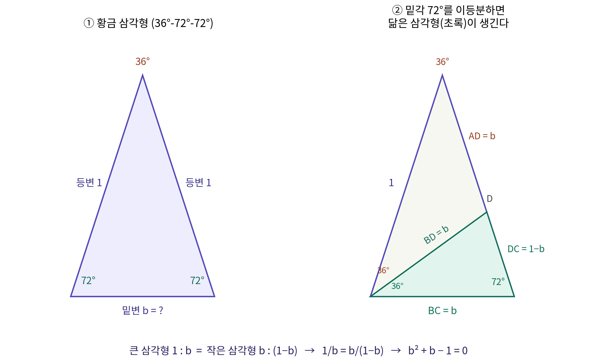

# 정이십면체의 수들 — φ, sin 54°, sin 72°에 관한 에세이

## 1. 서론

정이십면체(regular icosahedron)는 정삼각형 20개로 이루어진 정다면체다. 엣지 길이 ℓ 하나만 정하면 도형의 모든 치수가 결정되는데, 그 치수들을 계산하는 과정에서 0.618, 0.809, 0.951, 1.618 같은 수들이 반복해서 나타난다. 이 에세이는 이 수들이 각각 무엇이며 왜 하필 이 값들인지를, 고등학교 수학(내각의 합, 닮음, 근의 공식, 삼각비)만으로 처음부터 끝까지 유도한 기록이다.

## 2. 기본 수들: 20, 30, 12

- 면(face): 정삼각형 **20개**
- 모서리(edge): **30개**
- 꼭짓점(vertex): **12개**

이 세 수는 오일러의 다면체 공식을 만족한다.

$$V - E + F = 12 - 30 + 20 = 2$$

또 하나 기억할 사실: **각 꼭짓점에는 정삼각형이 정확히 5개씩 모인다.** 이 "5"가 이후 등장하는 모든 수의 근원이 된다.

## 3. 황금비 φ의 정의

황금비는 방정식 x² = x + 1 의 양의 해로 정의된다.

$$\varphi = \frac{1+\sqrt{5}}{2} \approx 1.618$$

이 정의에는 각도도 다면체도 등장하지 않는 순수한 대수적 수다. 그런데 정이십면체를 계산하면 이 수가 어디에나 나타난다. 그 이유를 추적하려면 하나의 특별한 삼각형에서 출발해야 한다.

## 4. 황금 삼각형: 36°-72°-72°

**4.1 왜 밑각이 72°인가**

이등변 삼각형에서 우리가 선택하는 것은 꼭지각 36° 하나뿐이다. 밑각은 내각의 합 180°에서 계산된다.

$$36° + 밑각 \times 2 = 180° \;\;\Longrightarrow\;\; 밑각 = \frac{144°}{2} = 72°$$

꼭지각을 36°로 잡는 이유는 이 각이 정오각형에서 오기 때문이다. 정오각형의 중심각은 360° ÷ 5 = 72°이고, 펜타그램(오각별)의 꼭지각이 그 절반인 36°다. 정오각형의 한 변을 밑변으로, 두 대각선을 등변으로 삼으면 이 36°-72°-72° 삼각형이 그대로 나타난다.

**4.2 변의 길이 정의와 방정식 세우기**

등변의 길이를 1, 밑변을 b라 놓는다. 아래 그림이 이 설정과 다음 단계를 보여준다.

왼쪽(①)이 출발점이다: 등변 AB = AC = 1, 밑변 BC = b (미지수). 오른쪽(②)에서 밑각 B(72°)를 이등분한다. 이등분선이 변 AC와 만나는 점을 D라 하면, 각 변의 길이가 다음과 같이 확정된다.

- **삼각형 BDC**: 각 DBC = 36°, 각 C = 72°이므로 각 BDC = 72°. 즉 36°-72°-72°로 **원래 삼각형과 닮음**이다. 이등변이므로 같은 각(72°)을 마주보는 변이 같다: **BD = BC = b**
- **삼각형 ABD**: 각 A = 36°, 각 ABD = 36°로 이등변이다. 따라서 **AD = BD = b**
- 그러므로 **DC = AC − AD = 1 − b**

이제 닮은 두 삼각형에서 (등변):(밑변) 비를 읽는다. 큰 삼각형은 1 : b, 작은 삼각형(BDC)은 b : (1−b). 닮음이므로 두 비가 같다.

$$\frac{1}{b} = \frac{b}{1-b}$$

외항의 곱 = 내항의 곱:

$$1-b = b^2 \;\;\Longrightarrow\;\; b^2 + b - 1 = 0$$

**4.3 근의 공식으로 풀기**

일반형 ax² + bx + c = 0 과 비교하면 a = 1, b(계수) = 1, c = −1. 근의 공식에 대입한다.

$$x = \frac{-b \pm \sqrt{b^2-4ac}}{2a} = \frac{-1 \pm \sqrt{1-4(1)(-1)}}{2} = \frac{-1 \pm \sqrt{5}}{2}$$

√5 ≈ 2.236 이므로 두 해는 0.618 과 −1.618. 길이는 양수이므로:

$$b = \frac{\sqrt5-1}{2} \approx 0.618$$

검산: b² + b − 1 = 0.382 + 0.618 − 1 = 0 ✓

**4.4 이 값은 황금비의 역수다**

$$\varphi \times \frac{\sqrt5-1}{2} = \frac{(1+\sqrt5)(\sqrt5-1)}{4} = \frac{5-1}{4} = 1 \;\;\Longrightarrow\;\; b = \frac{1}{\varphi}$$

버린 음수 해의 크기는 정확히 φ다. 밑각을 한 번 이등분했을 뿐인데 황금비가 나온다 — 이 삼각형이 황금 삼각형(golden triangle)이라 불리는 이유다.

## 5. cos 72°

황금 삼각형의 꼭지각에서 밑변에 수선을 내리면 밑변이 b/2로 나뉘고, 밑각 72°를 낀 직각삼각형이 생긴다. cos의 정의(밑변/빗변)에 따라:

$$\cos 72° = \frac{b/2}{1} = \frac{1}{2}\cdot\frac{\sqrt5-1}{2} = \frac{\sqrt5-1}{4} = \frac{1}{2\varphi} \approx 0.309$$

## 6. sin 72°

sin² + cos² = 1 에 대입한다.

$$\sin^2 72° = 1 - \left(\frac{\sqrt5-1}{4}\right)^2 = 1 - \frac{6-2\sqrt5}{16} = \frac{10+2\sqrt5}{16}$$

$$\sin 72° = \frac{\sqrt{10+2\sqrt5}}{4} \approx 0.951$$

## 7. sin 54°와 황금 그노몬

등변이 ℓ, 꼭지각이 θ인 이등변 삼각형의 밑변은 b = 2ℓ sin(θ/2)다. 밑변과 등변의 비가 황금비가 되는 삼각형(b = φℓ)을 찾으면:

$$\sin\frac{\theta}{2} = \frac{\varphi}{2} \approx 0.809 \;\;\Longrightarrow\;\; \frac{\theta}{2}=54°,\;\;\theta = 108°$$

꼭지각 108°의 넓적한 이등변 삼각형 — 황금 그노몬(golden gnomon)이다. 정오각형을 대각선으로 자르면 뾰족한 황금 삼각형과 이 황금 그노몬, 두 종류만 나온다. 여기서 핵심 항등식이 얻어진다.

$$\frac{\varphi}{2} = \sin 54° = \cos 36° \approx 0.809 \qquad\Longleftrightarrow\qquad \varphi = 2\sin 54°$$

## 8. 정이십면체의 반지름들

엣지 길이가 ℓ인 정이십면체의 특성 길이:

- **외접구 반지름** (중심 → 꼭짓점): (ℓ/4)√(10+2√5) = **ℓ sin 72° ≈ 0.951ℓ**
- **중접구 반지름** (중심 → 모서리 중점): (ℓ/4)(1+√5) = **(φ/2)ℓ = ℓ sin 54° ≈ 0.809ℓ**
- 내접구 반지름 (중심 → 면 중심): ≈ 0.756ℓ

0.951과 0.809는 모순이 아니라 서로 다른 두 질문(꼭짓점까지인가, 모서리 중점까지인가)에 대한 서로 다른 두 답이다. 어떤 계산에서든 자신이 쓰는 R이 이 중 무엇인지 먼저 확정해야 한다.

## 9. 근원: 72° = 360°/5

| 각도 | 기하학적 의미 | 값 |
|---|---|---|
| 72° | 정오각형 중심각 (360°/5) | sin 72° ≈ 0.951 |
| 36° | 72°의 절반, 펜타그램 꼭지각 | cos 36° = φ/2 ≈ 0.809 |
| 54° | 90° − 36° | sin 54° = φ/2 ≈ 0.809 |
| 108° | 정오각형 내각 (180° − 72°) | 황금 그노몬 꼭지각 |

정이십면체의 각 꼭짓점에는 삼각형이 5개씩 모이고, 한 꼭짓점의 이웃 5개가 정오각형을 이룬다. 이 5회 회전 대칭 때문에 모든 치수 계산에 오각형의 각도들이 스며든다.

**꼭짓점당 삼각형 5개 → 5회 대칭 → 정오각형 (72°) → 황금 삼각형·황금 그노몬 → 근의 공식 → φ**

## 10. 좌표 검산: (0, ±1, ±φ)

정이십면체의 12개 꼭짓점은 다음 좌표와 그 순환 치환으로 주어진다.

$$(0,\ \pm1,\ \pm\varphi),\quad (\pm1,\ \pm\varphi,\ 0),\quad (\pm\varphi,\ 0,\ \pm1)$$

서로 직교하는 세 개의 황금비 직사각형(변의 비 1 : φ)의 꼭짓점들이다. 이 좌표계에서:

- 엣지 길이: (0, 1, φ)와 (0, −1, φ) 사이 거리 = 2
- 외접구 반지름: 원점에서 (0, 1, φ)까지 = √(1+φ²) ≈ 1.902
- 비율: 1.902 / 2 ≈ **0.951 = sin 72°** ✓

## 11. 결론

정이십면체는 조합적으로 20-30-12(면-모서리-꼭짓점)이고, 엣지 ℓ에 대해 0.951ℓ(외접구, sin 72°)과 0.809ℓ(중접구, sin 54° = φ/2)이라는 두 특성 길이를 갖는다. 이 값들은 전부 하나의 계산에서 유도된다 — 36°-72°-72° 황금 삼각형의 밑각을 이등분하고, 닮음비로 b² + b − 1 = 0 을 세우고, 근의 공식으로 b = (√5−1)/2 = 1/φ 를 얻는 것. 여기서 cos 72°가 나오고, 피타고라스 항등식으로 sin 72°가 나오고, 그 값들이 다면체의 반지름이 된다. 유도에 쓰인 도구는 내각의 합, 닮음, 근의 공식, 삼각비 — 전부 고등학교 수학이며, 그 출발점에는 근의 공식 한 줄이 있다.
